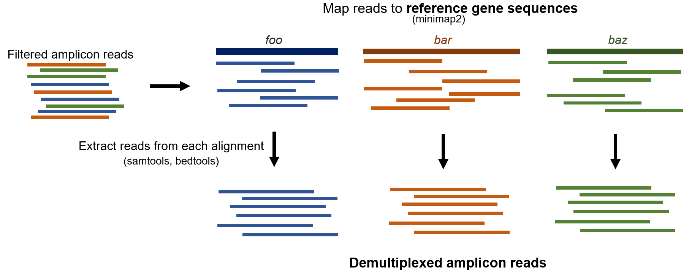

# Nanopore Sequencing for Biosecurity Workshop 2022 

### High-accuracy long-read amplicon consensus sequences reconstruction with Nanopore sequencing data

This is a tutorial as part of bioinformatics component for the course [Nanopore Sequencing for Biosecurity](https://cba.anu.edu.au/news-events/events/nanopore-sequencing-biosecurity) given on 28-30 November 2022 at the Australian National University.

## Environment installation

Use mamba to create an empty environment called <code>amplicon_prac</code>, then install all the required packages.

	conda create -n amplicon_prac
	conda activate amplicon_prac
	
	mamba install -c bioconda minimap2 samtools bedtools
	mamba install -c bioconda -c conda-forge medaka

Make sure you always have this environment activated. You can tell by seeing (amplicon_prac) in front of your command line, which looks like:

	(amplicon_prac) course_user@biosec:/some/path/...

## Course material installation

First navigate back into the biosec_course directory, and create a new directory.

	cd /home/course_user/biosec_course
	mkdir amplicon_prac
	cd amplicon_prac
	
Then clone this github repo with the following (**Don't forget the dot at the end!!)

	git clone https://github.com/ritatam/nanopore-biosecurity-workshop-2022/blob/main/amp_recon_course_material.zip .
	unzip amp_recon_course_material.zip		# Unzip the zip file
	rm amp_recon_course_material.zip		# Remove the zip file 

Type <code>ls</code> to see what's in your directory. If it prints:

	external_program fig fungal_ITS pst_lineage_genotyping

Then you're all set!

**If you wish, you can open a firebox browser INSIDE the virtual machine and go to https://github.com/ritatam/nanopore-biosecurity-workshop-2022, so it's easier to copy the codes around inside the virtual marchine.**

## Introduction
*Amplicon sequencing* is a highly targeted next-generation sequencing approach that enables analyses of genetic variations in specific genomic regions. Short-read sequencing has been commonly used in amplicon-related research for its high-throughput nature and low error rate, yet its read length limits the maximum amplicon size. Long-read amplicon sequencing allows for capturing long-range genetic information, which offers better solutions for in-depth analyses, such as resolving longer structural variations and phasing.

This tutorial will guide you through bioinformatic workflows to reconstruct high-accuracy amplicon consensus sequences with nanopore sequencing data, via the two case studies introduced in the presentation.

## **Case study 1 - Fungal identification by generating consensus sequence of full-ITS region for a species**

### Fungal barcoding with ITS region
Fungal identification using DNA barcoding based on internal transcribed spacer (ITS) located among nuclear rRNA genes has been routinely used by a lot of diversity studies. Full-ITS region contains two hypervariable spacers, ITS-1 and ITS-2, separated by the highly conserved 5.8S rRNA gene. The variations in ITS-1 and ITS-2 are species-specific, enabling the discriminatory power for taxonomy classification.

**Here, we will reconstruct a consensus sequence for the full-ITS region of a fungal species using long-read amplicons, which we will use to identify the fungus later.** My colleagues and I amplified the ITS region from the fungal gDNA, sequenced and basecalled the ampilcon long reads, then filtered the reads by read quality (Q>15) and length (2.5-3.5kbp). We will go through the following bioinformatic workflow for consensus reconstruction using these reads.

***
### 1. Generating a draft sequence

We will use the filtered reads in a fastq file to generate a draft sequence. This will be done using a clustering algorithm called USEARCH.

#### Define USEARCH file path

USEARCH is installed as a single executable file, in the course material you just downloaded. You need to tell the machine where it is. So, we will first define a variable called <code>USEARCH</code> as its absolute path. 

    USEARCH=/home/course_user/biosec_course/amplicon_prac/external_program/usearch11.0.667_i86linux32

Now, unlock the USEARCH program and run it. ***Don't foget the $ sign***!!!

	chmod 777 $USEARCH		# give user permission to use USEARCH
    $USEARCH
    
... which will print the following message. If you see this, your USEARCH is all set!

    usearch v11.0.667_i86linux32, 4.0Gb RAM (132Gb total), 32 cores
    (C) Copyright 2013-18 Robert C. Edgar, all rights reserved.
    https://drive5.com/usearch
    License: personal use only

We can now proceed to clustering our reads!

#### Run USEARCH to cluster the reads

First, change into the <code>fungal_ITS</code> directory, where the filtered nanopore reads <code>reads.fastq</code> file is located. You can use command <code>less</code> to view its content in a full-screen display mode. You can scroll up and down using mouse or arrow keys. To quit the display mode, simply press the "Q" key. 

    cd /home/course_user/biosec_course/amplicon_prac/fungal_ITS
    less reads.fastq

Now run the following USEARCH command to cluster our reads. We will set the sequence identity threshold to 0.75 with the <code>-id</code> flag.

    $USEARCH -cluster_fast reads.fastq -id 0.75 -strand both \
    -centroids centroids.id75.fasta -sizeout

> Flag explanations from USEARCH documentation:
> - <code>-cluster_fast</code>: Cluster sequences using UCLUST algorithm
> - <code>-id 0.75</code>: Minimum sequence identity threshold. Identity is defined as the fraction of columns in an alignment with matching
> letters.
> - <code>-strand both</code>: Search for hits of both forward and reverse complement strands.
> - <code>-centroids</code>: Write the centroid sequences to a FASTA file.
> - <code>-sizeout</code>: Annotate cluster size in the header of every centroid sequence in the FASTA file.

This will output a fasta file listing the centroid/representative sequences from all clusters. You can inspect the fasta file using <code>less</code>. Note the cluster size annotated at the end of each sequence header. As you can see, the centroid sequences are sorted in the descending order of cluster size. This means the first centroid sequence on top represents most reads with >75% similarity. 

    less centroids.id75.fasta

 *Tip: You can scroll up and down in the display mode to look at other centroid sequences. (What does size=1 indicate? How do these centroid sequences look like?)*

The first centroid sequence listed represents the highest number of similar nanopore reads. Let's extract it as our draft sequence with the following <code>awk</code> command. 

    awk "/^>/ {n++} n>1 {exit} {print}" centroids.id75.fasta > draft.fasta

This way, we can remove potential contamination or sequencing artifacts, and make sure that only similar reads from the amplicon under question will be considered in downstream analyses. Note: The draft sequence is highly representative yet still a nanopore **read**, so it might still contain errors that need to be polished downstream.

***

### 2. Generate and polish the consensus sequence

Now we can generate a consensus sequence from the draft, which we will polish four times. This process will generate a lot of intermediate files, so we will create a output directory named <code>polish</code> and navigate there.

	mkdir polish
	cd polish

Here, consensus sequence polishing is a three-step process:

1. <code>mini_align</code>: Map the filtered nanopore reads back to the draft sequence. This will output an alignment BAM file called <code>polish.round1.bam</code>. You can use it with the <code>-h</code> flag to print help message first. (Note: <code>mini_align</code> is a compact version of <code>minimap2</code> that comes with the medaka package, which can automatically generate all other intermediate files required by step 2-3 to save user's time)

		mini_align -h		# To print help message
		mini_align -i ../reads.fastq -r ../draft.fasta -m -p polish.round1 -t 1

2. <code>medaka consensus</code>: Run consensus algorithm across the assembly regions. It takes in the alignment file as input,  looks for potential sequencing errors, then attempts to "cancel" these errors out. The <code>--model</code> flag specifies which medaka model to use, based on the sequencing flowcell and basecaller version used (see medaka [documentation](https://github.com/nanoporetech/medaka) for details if you're interested). Output will be generated in .hdf format. 

		medaka consensus polish.round1.bam polish.round1.hdf --model r941_min_sup_g507 --threads 1

3. <code>medaka stitch</code>: Collate results from previous steps to create the polished consensus sequence in fasta format.

		medaka stitch polish.round1.hdf ../draft.fasta polish.round1.fasta

..You might see a heart attack-triggering error message that states "RuntimeWarning: divide by zero encountered in log10" at the end of it. Medaka authors said it's a bug that haven't been addressed, but can be safely ignored, so don't worry! (source: official github issue [thread](https://github.com/nanoporetech/medaka/issues/368))

***

Now we have polished the consensus sequence once. Let's repeat it for three more times! 

For your convenience, I've used <code>&&</code> to stitch the three commands together. In Linux, it means executing command that follows the <code>&&</code> ONLY if the previous command is successful. This allows you to run each code block below as a whole without running the commands one by one. Simply copy & paste and run the following:

Round 2

	mini_align -i ../reads.fastq -r polish.round1.fasta -m -p polish.round2 -t 1 && \
	medaka consensus polish.round2.bam polish.round2.hdf --model r941_min_sup_g507 --threads 1 && \
	medaka stitch polish.round2.hdf ../draft.fasta polish.round2.fasta

Round 3

	mini_align -i ../reads.fastq -r polish.round2.fasta -m -p polish.round3 -t 1 && \
	medaka consensus polish.round3.bam polish.round3.hdf --model r941_min_sup_g507 --threads 1 && \
	medaka stitch polish.round3.hdf ../draft.fasta polish.round3.fasta

Round 4

	mini_align -i ../reads.fastq -r polish.round3.fasta -m -p polish.round4 -t 1 && \
	medaka consensus polish.round4.bam polish.round4.hdf --model r941_min_sup_g507 --threads 1 && \
	medaka stitch polish.round4.hdf ../draft.fasta polish.round4.fasta

Woohoo, you have the final polished consensus sequence for the full-ITS region amplicons in <code>polish.round4.fasta</code> now! 

***
### 3. BLAST it against NCBI databases to identify the fungus

Print the <code>polish.round4.fasta</code> file to copy the final consensus sequence.

	cat polish.round4.fasta

Go to [NCBI BLAST search engine](https://blast.ncbi.nlm.nih.gov/Blast.cgi)

What are your BLAST results?

## **Case study 2 - Genotyping lineages of wheat stripe rust fungus by generating consensus sequences of multiple genes**

### Lineage genotyping 

Stripe rust (*Puccinia striiformis f. sp. tritici; **Pst***) is a fungal pathogen of wheat that poses devastating threat to agriculture. At present, there are a few stripe rust lineages (i.e. genetically distinct pathogen populations) spreading throughout Australia. Rapid and accurate lineage identification will enable more effective disease surveillance. 

Here, the aim is to perform lineage genotyping for three different stripe rust samples (Pst104, Pst134, Pst198) at a gene (let's call it "*foo*" gene). To save time, **we will reconstruct consensus sequence of the *foo* gene using long-read amplicons, for Pst104 only.**

***
### 1. Demultiplex the amplicons originating from different genes

**The problem:** During amplicon library preparation for sample Pst104, the *foo* amplicons were mixed with amplicons from other genes, and they were ligated with the same barcode. After sequencing them all together, we will need a way to demultiplex them in the read file, so we can deal with *foo* amplicons only. 

**The solution** is pretty simple - given that we know which genes these amplicons orginated from, we can simply map the pooled reads to the reference gene sequences to separate them. 

Let's do it! First navigate to the <code>pst_lineage_genotyping</code> directory to find the filtered nanopore read file <code>pst104_reads.fastq</code>, which contains reads of mixed amplicons from sample Pst104E. 

	cd /home/course_user/biosec_course/amplicon_prac/pst_lineage_genotyping
	less pst104_reads.fastq 	# To inspect the content

Create a directory for demultiplexing.

	mkdir demultiplex
	cd demultiplex

To separate the amplicon reads by genes, map them to reference gene sequences in <code>ref_genes.fasta</code> with <code>minimap2</code>.

	minimap2 -ax map-ont -t 1 ../ref_genes.fasta ../pst104_reads.fastq > pst104_genes.bam
	
Sort and index the output alignment BAM file with <code>samtools</code>. This step enables more efficient read data access and processing in the BAM file.

	samtools sort -O BAM pst104_genes.bam -o pst104_genes.sorted.bam
	samtools index pst104_genes.sorted.bam

Subset the **sorted** alignment BAM file at *foo* gene only, using<code>samtools</code>. 

	samtools view -b pst104_genes.sorted.bam "foo" > pst104_foo.bam

Extract the reads from the *foo* alignment, to generate a fastq file using <code>bedtools</code>. 

	bedtools bamtofastq -i pst104_foo.bam -fq pst104_foo.fastq

Now you have a fastq file containing amplicon reads that can be confidently mapped to the *foo* gene, which means they are (very likely) amplicons from *foo*. 

(Of course, for non-haploid organisms, this mapping approach might not be the most ideal because it can result in a mixture of reads from differing but similar haplotype sequences. However, phasing is not in the scope of this tutorial, so we will skip that for now.)

### 2. Run the amplicon consensus sequence recontruction pipeline

Now that we have the *foo* amplicon reads ready in <code>pst104_foo.fastq</code>, we can reconstruct the consensus sequence of *foo* for sample Pst104. This part is basically the same as what we have learnt in Case Study 1. 

First move the <code>pst104_foo.fastq</code> file out of the demultiplex directory.

	mv pst104_foo.fastq ..
	cd ..
	

#### Generating a draft sequence

Cluster reads using USEARCH

	$USEARCH -cluster_fast pst104_foo.fastq -id 0.75 -strand both \
	-centroids centroids.id75.fasta -sizeout
	
Extract top centroid sequence as the draft

	awk "/^>/ {n++} n>1 {exit} {print}" centroids.id75.fasta > draft.fasta

####  Generate and polish the consensus sequence

Create <code>polish</code> directory to store the intermediate files.

	mkdir polish
	cd polish

Simply copy and paste the following to polish the consensus sequence four times.

Round 1

	mini_align -i ../pst104_foo.fastq -r ../draft.fasta -m -p polish.round1 -t 1 && \
	medaka consensus polish.round1.bam polish.round1.hdf --model r941_min_sup_g507 --threads 1 && \
	medaka stitch polish.round1.hdf ../draft.fasta polish.round1.fasta

Round 2

	mini_align -i ../pst104_foo.fastq -r polish.round1.fasta -m -p polish.round2 -t 1 && \
	medaka consensus polish.round2.bam polish.round2.hdf --model r941_min_sup_g507 --threads 1 && \
	medaka stitch polish.round2.hdf ../draft.fasta polish.round2.fasta

Round 3

	mini_align -i ../pst104_foo.fastq -r polish.round2.fasta -m -p polish.round3 -t 1 && \
	medaka consensus polish.round3.bam polish.round3.hdf --model r941_min_sup_g507 --threads 1 && \
	medaka stitch polish.round3.hdf ../draft.fasta polish.round3.fasta

Round 4

	mini_align -i ../pst104_foo.fastq -r polish.round3.fasta -m -p polish.round4 -t 1 && \
	medaka consensus polish.round4.bam polish.round4.hdf --model r941_min_sup_g507 --threads 1 && \
	medaka stitch polish.round4.hdf ../draft.fasta polish.round4.fasta

This <code>polish.round4.fasta</code> is your final polished consensus sequence reconstructed using *foo* long-read amplicons of sample Pst104E! You can make a copy outside of the <code>polish</code> directory if you want:

	cp polish.round4.fasta ../pst104_foo.consensus.fasta

### 3. (Optional) Multiple sequence alignment

To inspect the genetic variants differing among the three above mentioned stripe rust lineages, I have supplied a fasta file in <code>amplicon_prac/pst_lineage_genotyping/extra</code> which lists the *foo* gene consensus sequences reconstructed from long-read amplicons from all three different samples (Pst104, Pst198 and Pst134), and Pst104's reference *foo* sequence from a high-quality genome annotation for confirmation. Please feel free to align these sequences in alignment visualisation tools such as Geneious. If you don't have them on your laptop, you can work with other attendees, or see the screenshots in the same folder!

Thank you for taking part in the course, I hope you enjoyed it and have learnt something about high-accuracy amplicon consensus reconstruction using Nanopore reads. Please feel free to contact me at Rita.Tam@anu.edu.au. 